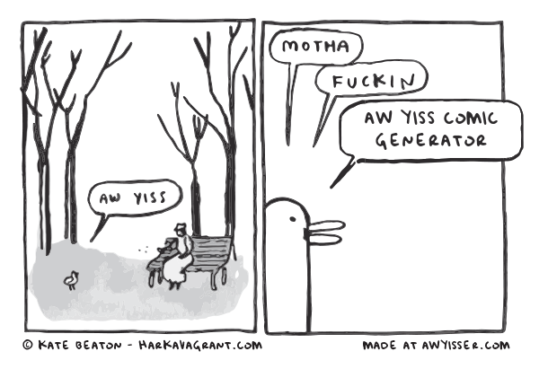

# Awyisser



[Awyisser](https://awyisser.com) is a simple ”[aw yiss](https://knowyourmeme.com/memes/aww-yiss)” comic generator built 
with [Next.js](https://nextjs.org/). 

## Generate a comic

### Via the web

Visit [awyisser.com](https://awyisser.com) if all you want to do is generate 
a comic and copy/paste/save it to use elsewhere.

### Via the API

[awyisser.com](https://awyisser.com) exposes a public API that can be used
to generate new comics. I make no promises to the long-term stability and 
availability of this API.

```curl
curl https://www.awyisser.com/api/generator \
    -X POST \
    -H "Content-Type: application/json" \
    -d {"value": "aw yiss comic generator"}
}
```

**Request body**
- `value` (required): A string between 1-40 characters. Not all characters 
  are supported. Prefer alphanumeric and basic punctuation.
- `sfw` (optional): Set to true to return ”mutha freakin” instead of ”mutha fucking”
  depending on sensibilities. Defaults to false.
}

**Success response**  
- Code: 200  
- Content: `{ image: string }`  
  Image is returned as a base64 encoded png data string.

## Muck around yourself

Clone this repo and run `npm install`. Then, run the development server:

```bash
npm run dev
```

Open [http://localhost:3000](http://localhost:3000) with your browser to see the result.
